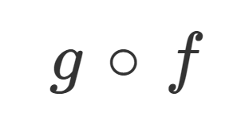

# compose

[![Build Status][travis-image]][travis-url]
[![NPM version][npm-image]][npm-url]
[![Dependency Status][david-image]][david-url]
[![License][license-image]][license-url]
[![Test coverage][coveralls-image]][coveralls-url]
[![Js Standard Style][standard-image]][standard-url]

Compose two or _more_ functions together.



## What is it?

If you aren't familiar with function composition you can read all about it [here](http://scott.sauyet.com/Javascript/Talk/Compose/2013-05-22/#slide-0).

## Installation

```bash
$ npm install @structs/compose
```

## Example

```js
var times2plus1 = compose(plus1, times2)
// times2plus1(3) -> 7

function plus1 (x) {
  return x + 1
}

function times2 (x) {
  return x * 2
}
```

## Usage

Documentation is available [here](./docs/index.md).

## Tests

```bash
$ npm test
```

## License

[MIT][license-url]

[npm-image]: https://img.shields.io/npm/v/structs-compose.svg?style=flat-square
[npm-url]: https://npmjs.org/package/structs-compose

[david-image]: http://img.shields.io/david/structs/compose.svg?style=flat-square
[david-url]: https://david-dm.org/structs/compose

[license-image]: http://img.shields.io/npm/l/structs-compose.svg?style=flat-square
[license-url]: ./license

[travis-image]: https://img.shields.io/travis/structs/compose.svg?style=flat-square
[travis-url]: https://travis-ci.org/structs/compose

[coveralls-image]: https://img.shields.io/coveralls/structs/compose/master.svg?style=flat-square
[coveralls-url]: https://coveralls.io/r/structs/compose?branch=master

[standard-image]: https://img.shields.io/badge/code%20style-standard-brightgreen.svg?style=flat-square
[standard-url]: https://github.com/feross/standard